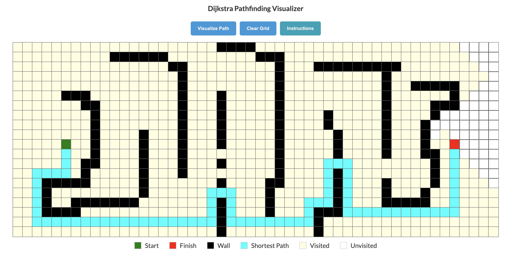

# Pathfinding Visualizer

An interactive pathfinding algorithm simulator that lets users visualize Dijkstra's shortest path algorithm and understand grid-based routing.

## Demo

Check out the live demo **[here](https://devbaggett.github.io/pathfinding-visualizer/)** deployed on GitHub Pages.



## Features

- Visualize Dijkstra's shortest path algorithm.
- Draw walls or obstacles on the grid to challenge the algorithm.
- Interactive grid allowing users to understand how pathfinding works in different scenarios.
- Clear the grid to reset and try new patterns.

## Getting Started

### Prerequisites

- Node.js and npm installed. If not, download and install them from [here](https://nodejs.org/).

### Installation

1. Clone the repository:
   ```bash
   git clone https://github.com/your-github-username/pathfinding-visualizer.git

2. Navigate to the project directory:
   ```bash
   cd pathfinding-visualizer
   
3. Install the required dependencies:
   ```bash
   npm install
   
### Running the App

1. Start the development server:
   ```bash
   npm start

2. Open your browser and visit http://localhost:3000/ (or the link provided in the terminal).

3. Start by drawing walls on the grid, then click "Visualize Dijkstra's Algorithm" to see the algorithm in action.

4. Use the "Clear Grid" button to reset the grid and create new patterns.

## How to Use

1. **Draw Walls**: Click and drag your mouse over the grid to create walls or obstacles.

2. **Remove Walls**: Click and drag your mouse over existing walls or obstacles to remove them.

3. **Visualize Algorithm**: Click the "Visualize Path" button to start the visualization. The algorithm will find the shortest path considering the walls you've drawn.

4. **Clear Grid**: Reset the grid to its initial state by clicking the "Clear Grid" button.

## Todo
- Clean up the UI to be more aesthetically pleasing
- Add more algorithms to visualize
- Add animation effects
- Allow user to randomize and draw in wall patterns
- Allow user to select own start and end points
- Allow user to stop or pause in middle of pathfinding
- Allow variable animation speed

## Contributing
Feel free to fork this repository, make changes, and open a pull request if you think you've made improvements that should be shared.

## License
This project is open-source and available under the MIT License.

## Acknowledgements
Dijkstra's algorithm and the whole community of pathfinding enthusiasts.

Clément Mihailescu - https://www.youtube.com/watch?v=msttfIHHkak

